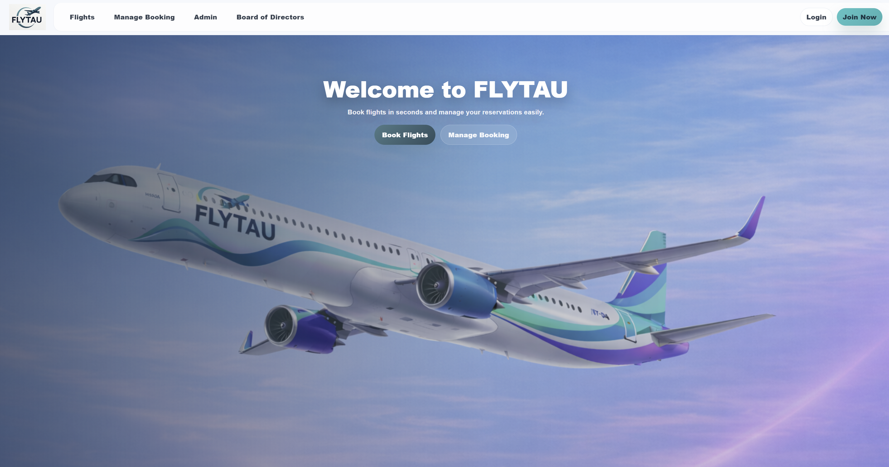

## FLYTAU

FLYTAU is an airline information system designed to provide a comprehensive and integrated solution for managing flights and ticket sales.  
The system supports the full lifecycle of airline operations, including flight creation, booking management, crew assignment, and operational analytics.

This repository contains the implementation developed as part of the **Information Systems** academic course.

### Overview


FLYTAU is a web-based airline platform that enables both operational management and customer-facing services.

#### Customer Functionality
- Ticket purchasing for both **Registered Customers** and **Unregistered Customers**.
- Flight search through a public flight board.
- Ticket cancellation under predefined conditions.

#### Administrative Functionality
- Secure **Admin** login.
- Creation and cancellation of **Flights** (under predefined conditions).
- Assignment of flight crews: **Pilots** and **Flight Attendants**.
- Addition and management of crew members.
- Access to statistical insights and reports regarding completed flights.

#### Aircrafts
- The airline operates aircraft from different manufacturers: **Boeing**, **Airbus**, and **Dassault**.
- Aircraft are classified by size:
  - **Large** aircraft support both **Business** and **Economy** Classes.
  - **Small** aircraft support **Economy** Class only.
- Each **Flight** is staffed by **Pilots** and **Flight Attendants**, each holding specific certifications for either short-haul or long-haul flights.
 
 ---
 
### Installation

The project dependencies are listed in a `requirements.txt` file.

To install all required packages, run:

```bash
pip install -r requirements.txt
```

---

### Architecture

FLYTAU is implemented as a modular web application:
- **Backend**: Python server built with **Flask**, handling business logic, authentication, and database access.
- **Frontend**: HTML templates and CSS for customer and admin interfaces.
- **Database**: Relational database implemented using **MySQL**, designed according to a relational schema and entity relationships to support Flights, Bookings, Classes, Aircraft, and Staff entities.

---

### Deployment

The project was deployed using **PythonAnywhere**, enabling public access to the web application.

Live deployment:
https://segev.pythonanywhere.com/

---

### Assumptions

### General Assumptions
- The **Customers** table contains customer users only and does not include administrative users.
- Administrative users are not part of the flight crew.
- Each flight is **one-way**.
- Every administrative user is authorized to perform all administrative functions.
- A ticket may be canceled less than **36 hours before departure** with **no refund**.
- Time values are represented in the format **X.Y**, where:
  - **X** represents whole hours,
  - **Y** represents the fractional part of the hour.
- Each booking contains **exactly one flight** and applies to **one direction only**.
- Each employee is associated with **a single phone number**.

### Interface Assumptions
- An administrator selects a flight route from a predefined route repository provided by the airline.
- An administrator sets ticket prices with a distinction between **Business Class** and **Economy Class**.


